# CI/CD Setup Guide

## Overview

This project uses GitHub Actions for automated CI/CD with AWS using OIDC (OpenID Connect) for secure, credential-less authentication.

## Architecture

```
Commit to dev  → Auto Deploy to DEV  → Build Training Container
Commit to main → Plan → Manual Approval → Deploy to PROD → Build Container
```

---

## Prerequisites

### 1. Setup Terraform Backend (One-Time)

Run the setup script to create S3 backend for Terraform state:

```powershell
# From project root
.\tools\setup-backend.ps1
```

This creates:
- S3 bucket for Terraform state (with encryption + versioning)
- DynamoDB table for state locking

### 2. AWS OIDC Provider Setup

Create an OIDC provider in AWS to allow GitHub Actions to assume IAM roles without long-lived credentials.

```bash
# Get your AWS Account ID
AWS_ACCOUNT_ID=$(aws sts get-caller-identity --query Account --output text)
REPO="cristofima/AWS-AutoML-Lite"

# Create OIDC provider (only once per AWS account)
aws iam create-open-id-connect-provider \
  --url https://token.actions.githubusercontent.com \
  --client-id-list sts.amazonaws.com \
  --thumbprint-list 6938fd4d98bab03faadb97b34396831e3780aea1
```

### 3. Create IAM Role for GitHub Actions

```bash
# Create trust policy
cat > github-actions-trust-policy.json <<EOF
{
  "Version": "2012-10-17",
  "Statement": [
    {
      "Effect": "Allow",
      "Principal": {
        "Federated": "arn:aws:iam::${AWS_ACCOUNT_ID}:oidc-provider/token.actions.githubusercontent.com"
      },
      "Action": "sts:AssumeRoleWithWebIdentity",
      "Condition": {
        "StringEquals": {
          "token.actions.githubusercontent.com:aud": "sts.amazonaws.com"
        },
        "StringLike": {
          "token.actions.githubusercontent.com:sub": "repo:${REPO}:*"
        }
      }
    }
  ]
}
EOF

# Create IAM role
aws iam create-role \
  --role-name GitHubActionsDeployRole \
  --assume-role-policy-document file://github-actions-trust-policy.json \
  --description "Role for GitHub Actions to deploy AWS AutoML Lite"
```

### 4. Attach Permissions to Role

```bash
# Create deployment policy
cat > github-actions-permissions.json <<EOF
{
  "Version": "2012-10-17",
  "Statement": [
    {
      "Effect": "Allow",
      "Action": [
        "s3:*",
        "dynamodb:*",
        "lambda:*",
        "apigateway:*",
        "batch:*",
        "ecr:*",
        "iam:*",
        "logs:*",
        "ec2:Describe*",
        "ec2:CreateSecurityGroup",
        "ec2:DeleteSecurityGroup",
        "ec2:AuthorizeSecurityGroupIngress",
        "ec2:RevokeSecurityGroupIngress",
        "ec2:AuthorizeSecurityGroupEgress",
        "ec2:RevokeSecurityGroupEgress",
        "ecs:*",
        "xray:*",
        "cloudwatch:*",
        "sts:GetCallerIdentity"
      ],
      "Resource": "*"
    }
  ]
}
EOF

# Create and attach policy
aws iam put-role-policy \
  --role-name GitHubActionsDeployRole \
  --policy-name DeploymentPermissions \
  --policy-document file://github-actions-permissions.json

# Get role ARN
aws iam get-role --role-name GitHubActionsDeployRole --query 'Role.Arn' --output text
```

**Save this ARN - you'll need it for GitHub Secrets!**

---

## GitHub Configuration

### 1. Verify Deployment (Optional)

After deploying infrastructure, verify all resources:

```powershell
.\tools\verify-resources.ps1
```

This validates API Gateway, Lambda, S3, DynamoDB, Batch, ECR, CloudWatch, and IAM resources.

### 2. Add Repository Secret (Shared by All Workflows)

Go to: **Settings → Secrets and variables → Actions → New repository secret**

- Name: `AWS_ROLE_ARN`
- Value: `arn:aws:iam::YOUR_ACCOUNT:role/GitHubActionsDeployRole`

**That's it!** One secret for all environments.

### 3. Create GitHub Environments (Only for Production Protection)

Go to: **Settings → Environments** and create:

#### **prod** Environment
- ✅ Required reviewers: Add yourself
- ✅ Wait timer: 0 minutes (optional: 5-30 min for rollback window)

**Note:** `dev` doesn't need an environment - uses the repository secret directly.

### 4. Enable GitHub Actions

Go to: **Settings → Actions → General**
- Workflow permissions: ✅ Read and write permissions
- Allow GitHub Actions to create and approve pull requests: ✅ Enabled

---

## Workflow Overview

### **ci-validate.yml** - Continuous Integration
**Triggers:** Push/PR to dev or main  
**Actions:**
- Validates Terraform formatting and syntax
- Tests Backend API imports and linting
- Validates Training container builds
- Type-checks Frontend (Next.js)

**Smart triggers:** Only runs jobs for changed components

### **deploy-lambda-api.yml** - Lambda API Deployment
**Triggers:** Changes to `backend/api/` or manual  
**Actions:**
1. Build Lambda package (Docker)
2. Update Lambda function code only
3. Test API health endpoint

**Fast deployment:** ~2-3 minutes (only API, no infrastructure)

### **deploy-training-container.yml** - Training Container Deployment
**Triggers:** Changes to `backend/training/` or manual  
**Actions:**
1. Build training Docker image
2. Push to ECR with environment tag
3. Tag as `:latest` for Batch jobs

**Fast deployment:** ~3-5 minutes (only container, no infrastructure)

### **deploy-frontend.yml** - Frontend Deployment
**Triggers:** Changes to `frontend/` or manual  
**Actions:**
1. Check infrastructure exists (auto-validation)
2. Get API URL from Terraform outputs (automatic)
3. Build Next.js static export with API URL
4. Deploy to S3 bucket
5. Invalidate CloudFront cache
6. Test frontend accessibility

**Smart features:**
- Automatically validates infrastructure is deployed first
- Retrieves API URL from Terraform (no manual configuration)
- Separate deployments for dev/prod environments
- Fast deployment: ~3-5 minutes

**Fast deployment:** ~3-5 minutes (frontend only, no infrastructure)

### **deploy-infrastructure.yml** - Full Infrastructure Deployment
**Triggers:** Changes to `infrastructure/terraform/` or manual  
**Actions:**
1. **Plan Job**: Generate Terraform plan
2. **Deploy Job** (requires approval for prod):
   - Apply infrastructure changes
   - Build and deploy Lambda
   - Test API health
3. **Post-Deploy Job**: Build and push training container

**Production requires manual approval** - full safety!

### **destroy-environment.yml** - Teardown Infrastructure
**Triggers:** Manual only  
**Actions:**
- Requires typing "DESTROY" to confirm
- Production destruction requires repository owner
- Runs `terraform destroy` for selected environment

---

## Usage Examples

### Deploy Lambda API Only (Fast - 2 min)
```bash
# Edit API code
git add backend/api/
git commit -m "fix: Update health endpoint response"
git push origin dev

# ✅ Only Lambda function updated
# ✅ Infrastructure untouched
# ✅ Training container untouched
```

### Deploy Training Container Only (Fast - 3 min)
```bash
# Edit training code
git add backend/training/
git commit -m "feat: Add XGBoost hyperparameter tuning"
git push origin dev

# ✅ Only ECR image updated
# ✅ Infrastructure untouched
# ✅ Lambda function untouched
```

### Deploy Frontend Only (Fast - 3 min)
```bash
# Edit frontend code
git add frontend/
git commit -m "feat: Add training progress bar"
git push origin dev

# ✅ Only frontend updated (S3 + CloudFront invalidation)
# ✅ Infrastructure untouched
# ✅ API untouched
# ✅ Automatically gets API URL from Terraform
```

### Deploy Infrastructure (Full - 10 min)
```bash
# Edit Terraform
git add infrastructure/terraform/
git commit -m "feat: Add CloudWatch alarms"
git push origin dev

# ✅ Infrastructure deployed
# ✅ Lambda rebuilt and deployed
# ✅ Training container rebuilt and pushed
```

### Deploy to Production
```bash
# Merge dev to main
git checkout main
git merge dev
git push origin main

# ⏳ Waits for manual approval if infrastructure changed
# Go to: Actions → Review deployments → Approve
```

### Manual Component Deploy
```bash
# Go to: Actions → Select workflow
# - Deploy Lambda API
# - Deploy Training Container
# - Deploy Frontend
# - Deploy Infrastructure
# Click "Run workflow" → Select environment → Run
```

**Note for Frontend Deployment:**
- Frontend deployment will automatically check if infrastructure exists
- If infrastructure not found, it will fail with clear instructions
- Deploy infrastructure first, then frontend will work automatically

### Destroy Environment
```bash
# Go to: Actions → Destroy Environment
# Select environment (dev/prod)
# Type "DESTROY" to confirm
# Approve if production
```

---

## Deployment Order & Dependencies

### 🎯 Automatic Dependency Resolution

The workflows are smart and **automatically validate dependencies**:

```
Infrastructure (Terraform)
    ↓ (creates API Gateway, S3, CloudFront)
    ├→ Backend API (Lambda)
    ├→ Training Container (ECR/Batch)
    └→ Frontend (S3 + CloudFront)
         ↓ (automatically gets API URL from Terraform outputs)
```

### ✅ First-Time Setup Order

When deploying a **new environment** from scratch:

1. **Deploy Infrastructure** (Required first)
```bash
cd infrastructure/terraform
terraform workspace select dev
terraform apply
```
   - Creates all AWS resources
   - Outputs API Gateway URL
   - Creates S3 + CloudFront for frontend
   - Takes ~5-10 minutes

2. **Deploy Backend API** (Automatic after infrastructure)
```bash
# Either:
# - Workflow runs automatically if triggered by infrastructure deployment
# - Or manually: Actions → Deploy Lambda API
```
   - Deploys FastAPI code to Lambda
   - Takes ~2-3 minutes

3. **Deploy Training Container** (Automatic after infrastructure)
```bash
# Either:
# - Workflow runs automatically if triggered by infrastructure deployment  
# - Or manually: Actions → Deploy Training Container
```
   - Builds and pushes Docker image to ECR
   - Takes ~3-5 minutes

4. **Deploy Frontend** (Automatic dependency check)
```bash
# Either:
# - Push changes to frontend/
# - Or manually: Actions → Deploy Frontend
```
   - **Automatically checks if infrastructure exists**
   - **Automatically retrieves API URL from Terraform**
   - Builds Next.js static site with correct API URL
   - Deploys to S3 and invalidates CloudFront
   - Takes ~3-5 minutes

### 🔄 Subsequent Deployments

After initial setup, you can deploy components **independently**:

| Component | Checks Infrastructure? | Gets API URL? | Independent? |
|-----------|------------------------|---------------|--------------|
| Infrastructure | N/A | N/A | ✅ Yes |
| Lambda API | ✅ Auto-validates | N/A | ✅ Yes (if infra exists) |
| Training Container | ✅ Auto-validates | N/A | ✅ Yes (if infra exists) |
| Frontend | ✅ Auto-validates | ✅ Auto-retrieves | ✅ Yes (if infra exists) |

### ❌ What Happens if You Deploy in Wrong Order?

**Scenario: Deploy frontend before infrastructure**
```
✅ Workflow starts
✅ Checks if infrastructure exists
❌ Infrastructure not found
❌ Workflow fails with clear message:
   "Infrastructure must be deployed first!"
   "Run 'Deploy Infrastructure' workflow for dev environment"
```

**No broken deployments** - the workflow protects you!

### 🎯 How API URL is Passed (Automatic)

You asked: *"¿Cómo se pasa la variable para la URL del backend?"*

**Answer: Completely automatic via Terraform outputs!**

```yaml
# In deploy-frontend.yml workflow:

# Step 1: Get API URL from Terraform (automatic)
- name: Get Infrastructure Outputs
  run: |
    cd infrastructure/terraform
    terraform workspace select ${{ env.ENVIRONMENT }}
    API_URL=$(terraform output -raw api_gateway_url)  # ← Automatic!
    echo "api_url=$API_URL" >> $GITHUB_OUTPUT

# Step 2: Build with API URL as environment variable
- name: Build Frontend
  env:
    NEXT_PUBLIC_API_URL: ${{ steps.infra.outputs.api_url }}  # ← Injected automatically!
  run: pnpm build
```

**No manual configuration needed!** The workflow:
1. ✅ Checks infrastructure exists
2. ✅ Retrieves API URL from Terraform state
3. ✅ Builds frontend with correct API URL
4. ✅ Deploys to S3
5. ✅ Invalidates CloudFront cache

### 🚦 Validation Flow

```mermaid
graph TD
    A[Frontend Workflow Starts] --> B{Infrastructure exists?}
    B -->|No| C[❌ Fail with instructions]
    B -->|Yes| D[Get API URL from Terraform]
    D --> E[Build Next.js with API URL]
    E --> F{Frontend resources exist?}
    F -->|No| G[⚠️ Build only, skip deploy]
    F -->|Yes| H[Deploy to S3]
    H --> I[Invalidate CloudFront]
    I --> J[✅ Success]
```



### 📝 Manual Override (Optional)

If you need to manually specify API URL (not recommended):

```bash
# Local development
cd frontend
export NEXT_PUBLIC_API_URL=https://your-api.execute-api.us-east-1.amazonaws.com/dev
pnpm build
```

But in CI/CD, **it's always automatic** - no manual steps required!

---

## Monitoring Deployments

### View Deployment Status
1. Go to **Actions** tab
2. Click on running workflow
3. View live logs

### View Terraform Plans
- Plans are added as comments on PRs
- Plan artifacts available for 5-7 days in workflow runs

### Deployment Issues
- Production deployments automatically create GitHub Issues
- Track: **Issues → Label: deployment**

---

## Security Best Practices

### ✅ Implemented
- OIDC authentication (no AWS credentials in secrets)
- Environment-based approvals for production
- Terraform state locking (prevents concurrent runs)
- Least-privilege IAM roles
- Plan before apply (review changes)

### 🔒 Additional Recommendations
1. Enable branch protection rules:
   - Require PR reviews before merge
   - Require status checks to pass
2. Rotate IAM role permissions quarterly
3. Monitor CloudWatch for unusual activity
4. Set up billing alerts for unexpected costs

---

## Troubleshooting

### "Error: No valid credential sources found"
- Check `AWS_ROLE_ARN` secret is set in environment
- Verify OIDC provider exists in AWS
- Ensure IAM role trust policy includes GitHub repo

### "Error: acquiring state lock"
- Another workflow is running
- Check DynamoDB locks table
- If stuck, manually release lock:
  ```bash
  terraform force-unlock <LOCK_ID>
  ```

### "Terraform Plan Failed"
- Check Terraform syntax: `terraform validate`
- Ensure `.tfvars` files exist for environment
- Review CloudWatch logs for API errors

### "Docker build failed"
- Check Dockerfile.lambda syntax
- Ensure backend/requirements.txt is valid
- Verify base image is accessible

---

## Cost Monitoring

### GitHub Actions Usage
- **Free tier**: 2,000 minutes/month
- **Granular deployments save time:**
  - Lambda only: ~2 minutes
  - Training container only: ~3 minutes
  - Full infrastructure: ~10 minutes
- **Estimate:** ~300-500 deployments/month free (with granular approach)
- **Previous approach:** ~100-200 deployments/month (full deploys only)

### AWS Costs
- Infrastructure: ~$7-10/month (as documented)
- No additional CI/CD costs
- Monitor: AWS Cost Explorer with Project tag filter

---

## Advanced: Multi-Region Deployment

To deploy to multiple regions:

1. Create region-specific tfvars:
   - `dev-us-east-1.tfvars`
   - `dev-eu-west-1.tfvars`

2. Modify workflow matrix:
   ```yaml
   strategy:
     matrix:
       region: [us-east-1, eu-west-1]
   ```

3. Update Terraform backend to use region-specific state keys

---

## Support

**Issues?** 
- Check workflow logs in Actions tab
- Review Terraform state: `terraform state list`
- CloudWatch Logs: `/aws/lambda/automl-lite-*`

**Questions?**
- See main README.md
- Review docs/PROJECT_REFERENCE.md
- Check AWS CloudWatch logs

---

**Last Updated:** 2025-11-28  
**Status:** ✅ CI/CD Ready
