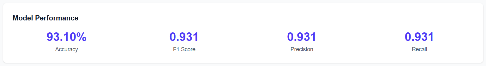
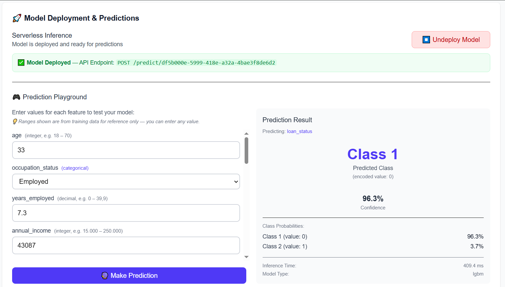
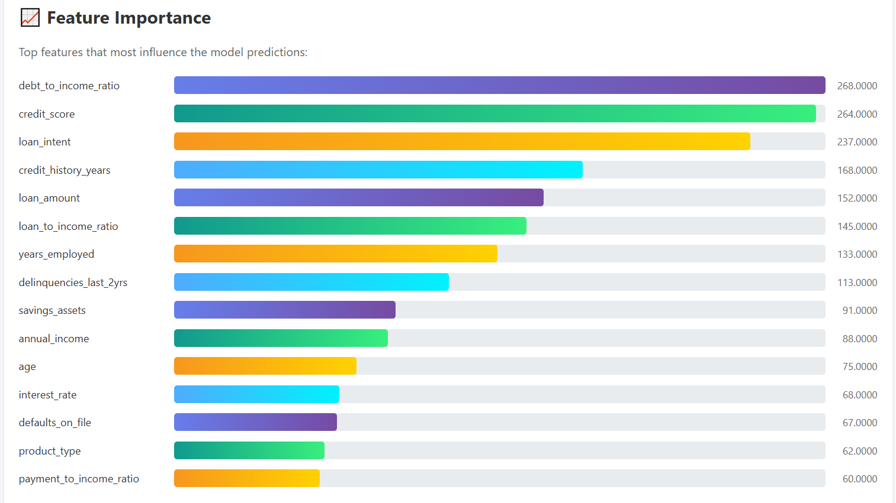

# AWS AutoML Lite

[](https://www.terraform.io/)
[](https://www.python.org/)
[](https://nodejs.org/)
[](https://nextjs.org/)
[](https://aws.amazon.com/)
[](LICENSE)

A lightweight, cost-effective AutoML platform built on AWS serverless architecture. Upload CSV files, automatically detect problem types, and train/predict machine learning models with just a few clicks.

## 🔄 CI/CD Status

| Workflow | Main | Dev |
|----------|------|-----|
| CI Terraform | [](https://github.com/cristofima/AWS-AutoML-Lite/actions/workflows/ci-terraform.yml) | [](https://github.com/cristofima/AWS-AutoML-Lite/actions/workflows/ci-terraform.yml) |
| Deploy Infrastructure | [](https://github.com/cristofima/AWS-AutoML-Lite/actions/workflows/deploy-infrastructure.yml) | [](https://github.com/cristofima/AWS-AutoML-Lite/actions/workflows/deploy-infrastructure.yml) |
| Deploy Lambda API | [](https://github.com/cristofima/AWS-AutoML-Lite/actions/workflows/deploy-lambda-api.yml) | [](https://github.com/cristofima/AWS-AutoML-Lite/actions/workflows/deploy-lambda-api.yml) |
| Deploy Training Container | [](https://github.com/cristofima/AWS-AutoML-Lite/actions/workflows/deploy-training-container.yml) | [](https://github.com/cristofima/AWS-AutoML-Lite/actions/workflows/deploy-training-container.yml) |
| Deploy Frontend | [](https://github.com/cristofima/AWS-AutoML-Lite/actions/workflows/deploy-frontend.yml) | [](https://github.com/cristofima/AWS-AutoML-Lite/actions/workflows/deploy-frontend.yml) |

## 🚀 Features

- **Smart Problem Detection**: Automatically classifies tasks as regression or classification based on data characteristics
- **Automated EDA**: Generates comprehensive exploratory data analysis reports
- **Model Training**: Uses FLAML for efficient AutoML with auto-calculated time budgets
- **Training History**: Track all your experiments with DynamoDB
- **Cost-Effective**: ~$3-25/month ($0 when idle) vs ~$36-171/month for SageMaker endpoints.
- **Portable Models**: Download trained models (.pkl and .onnx) for local use with Docker

### ✨ New in v1.1.0
- **Serverless Model Inference**: Deploy models and make predictions via Lambda (no SageMaker needed!)
- **Model Comparison**: Side-by-side comparison of multiple training runs
- **Dark Mode**: System preference detection with manual toggle
- **ONNX Export**: Cross-platform model deployment format

## 📸 Screenshots

> **Note:** Screenshots are organized by problem type. The examples below show a **classification** workflow. Regression screenshots with metrics like R², RMSE, and MAE are available in the `screenshots/regression/` folder.

<details>
<summary><strong>Configure Training</strong> - Select target column with auto problem detection</summary>


*Shows unique value counts per column and automatic classification/regression detection*
</details>

<details>
<summary><strong>Training Progress</strong> - Real-time training status monitoring</summary>


*Live updates showing current training phase and elapsed time*
</details>

<details>
<summary><strong>Results - Model Metrics</strong> - Classification metrics dashboard</summary>


*Displays Accuracy, F1 Score, Precision, and Recall (or R², RMSE, MAE for regression)*
</details>

<details>
<summary><strong>Model Deployment - Prediction Playground</strong> - Test your model interactively</summary>


*Serverless Lambda inference with real-time predictions and probability scores*
</details>

<details>
<summary><strong>Training Report - Feature Importance</strong> - Downloadable HTML report with interactive charts</summary>


*Bar chart showing which features contributed most to the model's predictions*
</details>

<details>
<summary><strong>EDA Report</strong> - Comprehensive exploratory data analysis</summary>


*Automated data quality analysis with warnings, correlations, and distributions*
</details>

> 📁 **41 total screenshots** available in the [screenshots](./screenshots/) folder:
> - **Common** (7): Compare models, time budget, jobs history, download/usage guides
> - **Classification** (20): Complete classification workflow with EDA & training reports
> - **Regression** (14): Complete regression workflow with EDA & training reports
>
> Screenshots are organized by problem type. See [screenshots/README.md](./screenshots/README.md) for the complete catalog.

## 🏗️ Architecture


<details>
<summary>Text version</summary>

```
User → AWS Amplify (Frontend - Next.js SSR)
         ↓
    API Gateway → Lambda (FastAPI - No containers, direct code)
         ↓
    DynamoDB + S3 (Metadata & Files)
         ↓
    AWS Batch → Fargate Spot (Training - Docker container)
```
</details>

**Why containers only for training?**
- Backend API: Direct Lambda deployment (5MB code)
- Training: Requires Docker due to 265MB ML dependencies (FLAML, scikit-learn, XGBoost) and jobs >15min
- See [ARCHITECTURE_DECISIONS.md](infrastructure/terraform/ARCHITECTURE_DECISIONS.md) for detailed analysis

## 📋 Prerequisites

- AWS Account
- AWS CLI v2 configured
- Terraform >= 1.9
- Docker installed
- Node.js 20+ (for frontend)
- Python 3.11+

## 🚀 Quick Start

### 1. Clone the repository
```bash
git clone https://github.com/cristofima/AWS-AutoML-Lite.git
cd AWS-AutoML-Lite
```

### 2. Deploy Infrastructure
```bash
cd infrastructure/terraform
terraform init
terraform apply
```

### 3. Build and Push Training Container
```bash
# See QUICKSTART.md for complete instructions
ECR_URL=$(terraform output -raw ecr_repository_url)
cd ../../backend/training
docker build -t automl-training:latest .
docker tag automl-training:latest $ECR_URL:latest
docker push $ECR_URL:latest
```

### 4. Get Your API URL
```bash
cd ../../infrastructure/terraform
terraform output api_gateway_url
```

📖 **Full instructions:** See [QUICKSTART.md](./docs/QUICKSTART.md)

## 📖 Documentation

- [QUICKSTART.md](./docs/QUICKSTART.md) - Complete deployment guide
- [PROJECT_REFERENCE.md](./docs/PROJECT_REFERENCE.md) - Technical documentation
- [ROADMAP.md](./docs/ROADMAP.md) - Product roadmap & future features
- [SETUP_CICD.md](./.github/SETUP_CICD.md) - CI/CD with GitHub Actions
- [ARCHITECTURE_DECISIONS.md](./infrastructure/terraform/ARCHITECTURE_DECISIONS.md) - Container usage rationale
- [LESSONS_LEARNED.md](./docs/LESSONS_LEARNED.md) - Challenges, solutions & best practices
- [FRONTEND_DEPLOYMENT_ANALYSIS.md](./docs/FRONTEND_DEPLOYMENT_ANALYSIS.md) - Frontend deployment decision analysis
- [CONTRIBUTING.md](./CONTRIBUTING.md) - Contribution guidelines
- [CHANGELOG.md](./CHANGELOG.md) - Version history

## 💰 Cost Estimation

Based on moderate usage (20 training jobs/month):

| Service | Monthly Cost |
|---------|-------------|
| AWS Amplify (Frontend) | $0-15 (Free Tier eligible) |
| Lambda + API Gateway | $1-2 |
| AWS Batch (Fargate Spot) | $1-5 |
| S3 + DynamoDB | $1-3 |
| **Total** | **~$3-25/month** |

> [!NOTE]
> **Why $0-15 for Amplify?** Most side projects will stay within the **AWS Free Tier** ($0). The $15 estimate covers conservative usage for projects that exceed Free Tier limits (1,000 build minutes/month) or have higher traffic requiring more SSR compute (Lambda) resources.

## 🧪 Local Development

### Using Docker Compose (Recommended)
```bash
# 1. Configure environment
cp backend/.env.example backend/.env
# Edit backend/.env with values from: terraform output

# 2. Start Backend API
docker-compose up

# 3. Start Frontend (separate terminal)
cd frontend
cp .env.local.example .env.local
# Edit .env.local with API URL
pnpm install && pnpm dev
```

### Without Docker
```bash
# Backend
cd backend
python -m venv venv
source venv/bin/activate  # Windows: .\venv\Scripts\Activate.ps1
pip install -r requirements.txt
uvicorn api.main:app --reload

# Frontend (separate terminal)
cd frontend
pnpm install && pnpm dev
```

## 📝 Usage

1. Upload a CSV file
2. Select your target column (UI shows unique values and auto-detects problem type)
3. Optionally configure time budget (auto-calculated based on dataset size if left empty)
4. Wait for training to complete
5. Download your model and view metrics

### Smart Features

| Feature | Description |
|---------|-------------|
| **Problem Type Detection** | Automatically detects Classification vs Regression using smart heuristics |
| **Smart Classification** | Integer-like values with ≤10 unique values → Classification |
| **Smart Regression** | Float values with decimals (35.5, 40.2) → Regression (even with low unique count) |
| **Auto Time Budget** | Based on dataset size: <1K rows→2min, 1K-10K→5min, 10K-50K→10min, >50K→20min |
| **Column Statistics** | Shows unique values count for each column to help with target selection |
| **ID Detection** | Automatically excludes identifier columns (order_id, customer_id, etc.) |
| **ONNX Export** | Cross-platform model format for deployment in any language |

## 🔮 Using Your Trained Model

After downloading your model (.pkl file), use Docker for predictions:

```bash
# Build prediction container (one time)
docker build -f scripts/Dockerfile.predict -t automl-predict .

# Show model info and required features
docker run --rm -v ${PWD}:/data automl-predict /data/model.pkl --info

# Generate sample input JSON (auto-detects features from model)
docker run --rm -v ${PWD}:/data automl-predict /data/model.pkl -g /data/sample_input.json

# Edit sample_input.json with your values, then predict
docker run --rm -v ${PWD}:/data automl-predict /data/model.pkl --json /data/sample_input.json

# Batch predictions from CSV
docker run --rm -v ${PWD}:/data automl-predict /data/model.pkl -i /data/test.csv -o /data/predictions.csv
```

See [scripts/README.md](./scripts/README.md) for detailed documentation.

## 📁 Component Documentation

| Component | README | Description |
|-----------|--------|-------------|
| Backend | [backend/README.md](./backend/README.md) | API development & Docker Compose |
| Frontend | [frontend/README.md](./frontend/README.md) | Next.js setup & pages |
| Training | [backend/training/](./backend/training/) | ML training container |
| Terraform | [infrastructure/terraform/README.md](./infrastructure/terraform/README.md) | Infrastructure as Code |
| Scripts | [scripts/README.md](./scripts/README.md) | Local training, predictions & diagram generation |

## 🤝 Contributing

Contributions are welcome! Please feel free to submit a Pull Request.

## 📄 License

This project is licensed under the MIT License - see the [LICENSE](./LICENSE) file for details.

## 👤 Author

**Cristopher Coronado** - AWS Community Builder

- GitHub: [@cristofima](https://github.com/cristofima)

## 🙏 Acknowledgments

- Built with FastAPI, FLAML, and Next.js
- Inspired by SageMaker Autopilot
- Part of AWS Community Builder program

---

**Status**: ✅ MVP Complete (Backend ✅ | Training ✅ | Frontend ✅)
