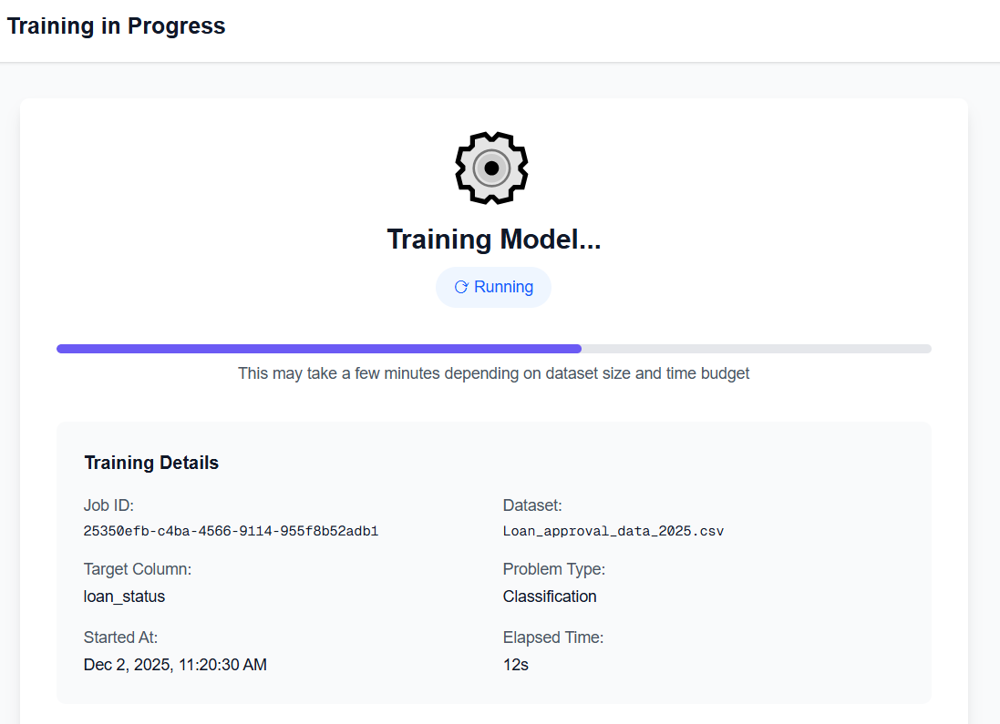
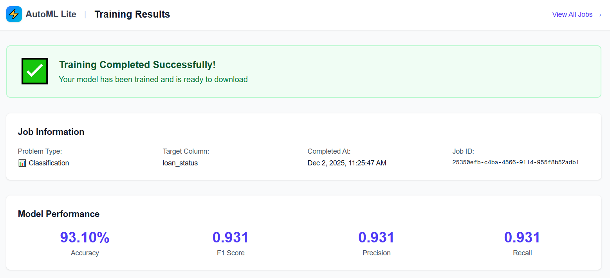
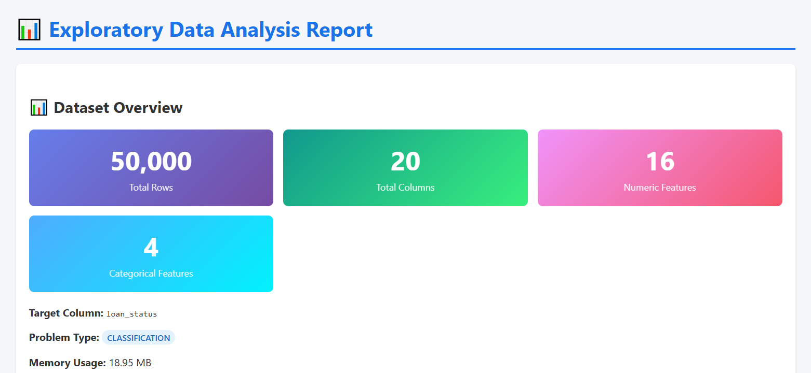

# AWS AutoML Lite

A lightweight, cost-effective AutoML platform built on AWS serverless architecture. Upload CSV files, automatically detect problem types, and train machine learning models with just a few clicks.

## 🚀 Features

- **Smart Problem Detection**: Automatically classifies tasks as regression or classification based on data characteristics
- **Automated EDA**: Generates comprehensive exploratory data analysis reports
- **Model Training**: Uses FLAML for efficient AutoML with auto-calculated time budgets
- **Training History**: Track all your experiments with DynamoDB
- **Cost-Effective**: ~$10-25/month (vs ~$150+/month for SageMaker real-time endpoints)
- **Portable Models**: Download trained models (.pkl) for local use with Docker

## 📸 Screenshots

<details>
<summary><strong>Configure Training</strong> - Select target column with auto problem detection</summary>


</details>

<details>
<summary><strong>Training Progress</strong> - Real-time training status monitoring</summary>


</details>

<details>
<summary><strong>Results - Model Metrics</strong> - View accuracy, F1 score, precision & recall</summary>


</details>

<details>
<summary><strong>Results - Feature Importance</strong> - Understand which features matter most</summary>


</details>

<details>
<summary><strong>EDA Report</strong> - Comprehensive exploratory data analysis</summary>


</details>

> 📁 More screenshots available in the [screenshots](./screenshots/) folder including full page captures of Configure (3), Training (3), Results (3), EDA Report (6), and Training Report (4)

## 🏗️ Architecture

```
User → AWS Amplify (Frontend - Next.js SSR)
         ↓
    API Gateway → Lambda (FastAPI - No containers, direct code)
         ↓
    DynamoDB + S3 (Metadata & Files)
         ↓
    AWS Batch → Fargate Spot (Training - Docker container)
```

**Why containers only for training?**
- Backend API: Direct Lambda deployment (5MB code)
- Training: Requires Docker due to 265MB ML dependencies (FLAML, scikit-learn, XGBoost) and jobs >15min
- See [ARCHITECTURE_DECISIONS.md](infrastructure/terraform/ARCHITECTURE_DECISIONS.md) for detailed analysis

## 📋 Prerequisites

- AWS Account
- AWS CLI v2 configured
- Terraform >= 1.5
- Docker installed
- Node.js 18+ (for frontend)
- Python 3.11+

## 🚀 Quick Start

### 1. Clone the repository
```bash
git clone https://github.com/cristofima/AWS-AutoML-Lite.git
cd AWS-AutoML-Lite
```

### 2. Deploy Infrastructure
```bash
cd infrastructure/terraform
terraform init
terraform apply
```

### 3. Build and Push Training Container
```bash
# See QUICKSTART.md for complete instructions
ECR_URL=$(terraform output -raw ecr_repository_url)
cd ../../backend/training
docker build -t automl-training:latest .
docker tag automl-training:latest $ECR_URL:latest
docker push $ECR_URL:latest
```

### 4. Get Your API URL
```bash
cd ../../infrastructure/terraform
terraform output api_gateway_url
```

📖 **Full instructions:** See [QUICKSTART.md](./docs/QUICKSTART.md)

## 📖 Documentation

- [QUICKSTART.md](./docs/QUICKSTART.md) - Complete deployment guide
- [PROJECT_REFERENCE.md](./docs/PROJECT_REFERENCE.md) - Technical documentation
- [SETUP_CICD.md](./.github/SETUP_CICD.md) - CI/CD with GitHub Actions
- [ARCHITECTURE_DECISIONS.md](./infrastructure/terraform/ARCHITECTURE_DECISIONS.md) - Container usage rationale
- [LESSONS_LEARNED.md](./docs/LESSONS_LEARNED.md) - Challenges, solutions & best practices
- [FRONTEND_DEPLOYMENT_ANALYSIS.md](./docs/FRONTEND_DEPLOYMENT_ANALYSIS.md) - Frontend deployment decision analysis

## 💰 Cost Estimation

Based on moderate usage (20 training jobs/month):

| Service | Monthly Cost |
|---------|-------------|
| AWS Amplify (Frontend) | $5-15 |
| Lambda + API Gateway | $1-2 |
| AWS Batch (Fargate Spot) | $2-5 |
| S3 + DynamoDB | $1-2 |
| **Total** | **~$10-25/month** |

## 🧪 Local Development

### Using Docker Compose (Recommended)
```bash
# 1. Configure environment
cp backend/.env.example backend/.env
# Edit backend/.env with values from: terraform output

# 2. Start Backend API
docker-compose up

# 3. Start Frontend (separate terminal)
cd frontend
cp .env.local.example .env.local
# Edit .env.local with API URL
pnpm install && pnpm dev
```

### Without Docker
```bash
# Backend
cd backend
python -m venv venv
source venv/bin/activate  # Windows: .\venv\Scripts\Activate.ps1
pip install -r requirements.txt
uvicorn api.main:app --reload

# Frontend (separate terminal)
cd frontend
pnpm install && pnpm dev
```

## 📝 Usage

1. Upload a CSV file
2. Select your target column (UI shows unique values and auto-detects problem type)
3. Optionally configure time budget (auto-calculated based on dataset size if left empty)
4. Wait for training to complete
5. Download your model and view metrics

### Smart Features

| Feature | Description |
|---------|-------------|
| **Problem Type Detection** | Automatically detects Classification vs Regression based on column characteristics |
| **Smart Classification** | Numeric columns with <20 unique values or <5% unique ratio → Classification |
| **Auto Time Budget** | Based on dataset size: <1K rows→2min, 1K-10K→5min, 10K-50K→10min, >50K→20min |
| **Column Statistics** | Shows unique values count for each column to help with target selection |

## 🔮 Using Your Trained Model

After downloading your model (.pkl file), use Docker for predictions:

```bash
# Build prediction container (one time)
docker build -f scripts/Dockerfile.predict -t automl-predict .

# Show model info and required features
docker run --rm -v ${PWD}:/data automl-predict /data/model.pkl --info

# Generate sample input JSON (auto-detects features from model)
docker run --rm -v ${PWD}:/data automl-predict /data/model.pkl -g /data/sample_input.json

# Edit sample_input.json with your values, then predict
docker run --rm -v ${PWD}:/data automl-predict /data/model.pkl --json /data/sample_input.json

# Batch predictions from CSV
docker run --rm -v ${PWD}:/data automl-predict /data/model.pkl -i /data/test.csv -o /data/predictions.csv
```

See [scripts/README.md](./scripts/README.md) for detailed documentation.

## 📁 Component Documentation

| Component | README | Description |
|-----------|--------|-------------|
| Backend | [backend/README.md](./backend/README.md) | API development & Docker Compose |
| Frontend | [frontend/README.md](./frontend/README.md) | Next.js setup & pages |
| Training | [backend/training/](./backend/training/) | ML training container |
| Terraform | [infrastructure/terraform/README.md](./infrastructure/terraform/README.md) | Infrastructure as Code |
| Scripts | [scripts/README.md](./scripts/README.md) | Prediction & local training |

## 🤝 Contributing

Contributions are welcome! Please feel free to submit a Pull Request.

## 📄 License

This project is licensed under the MIT License - see the [LICENSE](./LICENSE) file for details.

## 👤 Author

**Cristofima** - AWS Community Builder

- GitHub: [@cristofima](https://github.com/cristofima)

## 🙏 Acknowledgments

- Built with FastAPI, FLAML, and Next.js
- Inspired by SageMaker Autopilot
- Part of AWS Community Builder program

---

**Status**: ✅ MVP Complete (Backend ✅ | Training ✅ | Frontend ✅)
