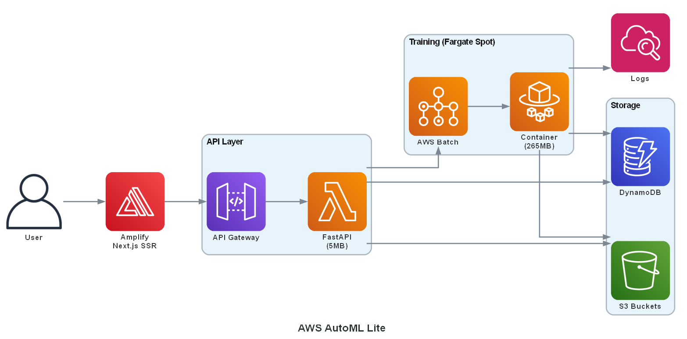
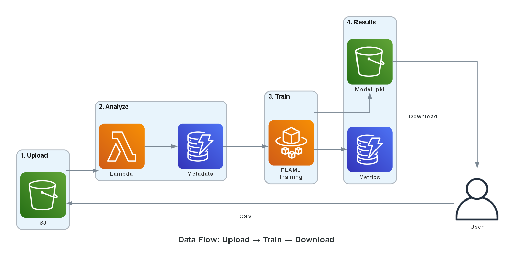
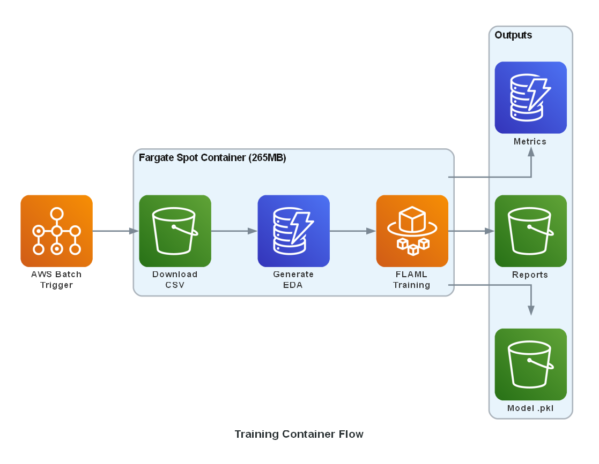

# AWS AutoML Lite - Project Reference

## 📑 Table of Contents

- [Project Overview](#-project-overview)
- [Architecture](#️-architecture)
- [Technical Stack](#-technical-stack)
- [Project Structure](#-project-structure)
- [Data Flow](#-data-flow)
- [API Endpoints](#-api-endpoints)
- [Training Pipeline](#️-training-pipeline)
- [Cost Analysis](#-cost-analysis)
- [Development Status](#-development-status)
- [Future Enhancements](#-future-enhancements)
- [Success Criteria](#-v100-success-criteria)
- [Technologies & Libraries](#-key-technologies--libraries)
- [Security Considerations](#-security-considerations)
- [References](#-references)

---

## 📋 Project Overview

**Goal:** Build a lightweight AutoML platform on AWS that allows users to upload CSV files, automatically detect problem types (classification/regression), perform EDA, train models, and maintain training history.

**Target Audience:** AWS Community Builder article (Year 5 - Intermediate/Advanced level)

**Current Version:** v1.1.0 (December 2025)

**Timeline:** 1 week MVP ✅ Completed

**Key Differentiators from SageMaker Autopilot:**
- Lightweight and cost-effective
- Portable model export (pkl, ONNX)
- Simplified UX for rapid prototyping
- Educational focus
- No SageMaker Studio dependency

---

## 🏗️ Architecture

### High-Level Architecture



<details>
<summary>Text version</summary>

```
User → AWS Amplify (Next.js SSR Frontend)
         ↓
    API Gateway → Lambda Functions (FastAPI + Mangum)
         ↓
    DynamoDB (metadata/history) + S3 (files)
         ↓
    Lambda triggers AWS Batch Job
         ↓
    Batch (Fargate Spot) → Train with FLAML
         ↓
    Save model to S3 + metrics to DynamoDB
```
</details>

### AWS Services Used

**Core Services (Must Have):**
- **S3**: Store datasets, trained models, EDA reports
- **DynamoDB**: Training history, metadata, job status
- **Lambda**: API endpoints (upload, list, get results)
- **API Gateway**: REST API
- **AWS Batch + Fargate Spot**: Async training for cost efficiency
- **CloudWatch**: Logs and metrics
- **IAM**: Granular roles per service

**Enhanced Services (Nice to Have):**
- **EventBridge**: Training completion events
- **X-Ray**: Distributed tracing
- **Systems Manager Parameter Store**: Configuration management
- **Step Functions**: (v2) Orchestrate ML pipeline

**Optional (Future):**
- **SageMaker Feature Store**: Store processed features
- **AWS Glue**: ETL for large datasets
- **SNS/SQS**: Async notifications

---

## 🎯 Technical Stack

### Frontend
- **Framework**: Next.js 16+ (App Router)
- **Deployment**: AWS Amplify (auto-deploy from Git)
- **Build**: pnpm with SSR support
- **Key Features**:
  - CSV upload with drag & drop
  - Column selection UI
  - Training history dashboard
  - Results visualization with embedded reports

### Backend
- **Framework**: FastAPI + Mangum (for Lambda)
- **Runtime**: Python 3.11
- **Deployment**: Direct code (ZIP), no containers
- **Key Components**:
  - CSV parsing and validation
  - Auto problem type detection (classification/regression)
  - DynamoDB operations
  - S3 presigned URLs
  - Batch job triggering

**Size:** ~5MB compressed (fits in Lambda without containers)

### Training Pipeline
- **Container**: Docker on Fargate Spot (required - see why below)
- **ML Libraries**: FLAML, scikit-learn, XGBoost, LightGBM
- **EDA**: Sweetviz
- **Deployment**: Docker container (ECR)
- **Size:** ~265MB uncompressed (exceeds Lambda 250MB limit)
- **Runtime:** 2-60 minutes (exceeds Lambda 15min timeout)
- **Process**:
  1. Download CSV from S3
  2. Auto EDA generation
  3. Data preprocessing
  4. Model training with cross-validation
  5. Save model (.pkl) to S3
  6. Save metrics to DynamoDB
  7. Upload HTML report to S3

**Why containers?** Training requires large ML dependencies (265MB) and can take >15 minutes, both exceeding Lambda limits. See [ARCHITECTURE_DECISIONS.md](infrastructure/terraform/ARCHITECTURE_DECISIONS.md) for full analysis.

### Infrastructure as Code
- **Tool**: Terraform
- **Language**: HCL
- **Why Terraform**: Cross-platform compatible (Windows/Linux/Mac), industry standard, portable, better for multi-cloud future

---

## 📂 Project Structure

```
aws-automl-lite/
├── backend/
│   ├── api/
│   │   ├── main.py                 # FastAPI app with Mangum
│   │   ├── routers/
│   │   │   ├── upload.py           # Upload endpoint
│   │   │   ├── training.py         # Start/status training
│   │   │   ├── datasets.py         # Dataset operations
│   │   │   ├── models.py           # Job management (CRUD, deploy)
│   │   │   └── predict.py          # Prediction endpoints (v1.1.0)
│   │   ├── services/
│   │   │   ├── s3_service.py       # S3 operations
│   │   │   ├── dynamo_service.py   # DynamoDB operations
│   │   │   └── batch_service.py    # Batch job trigger
│   │   ├── models/
│   │   │   └── schemas.py          # Pydantic models
│   │   └── utils/
│   │       └── helpers.py          # Common utilities
│   ├── training/                   # 👈 Modular ML Package
│   │   ├── __init__.py             # Package root
│   │   ├── main.py                 # Entry point (AWS Batch)
│   │   ├── Dockerfile              # Training container
│   │   ├── requirements.txt        # Training dependencies
│   │   ├── core/                   # Core ML components
│   │   │   ├── preprocessor.py     # Data preprocessing
│   │   │   ├── trainer.py          # FLAML training logic
│   │   │   └── exporter.py         # ONNX model export
│   │   ├── reports/                # Report generation
│   │   │   ├── eda.py              # Auto EDA generation
│   │   │   └── training.py         # Training results report
│   │   └── utils/                  # Shared utilities (DRY)
│   │       └── detection.py        # Problem type detection
│   ├── tests/                      # 👈 Unit & Integration Tests
│   │   ├── pytest.ini              # Pytest configuration
│   │   ├── api/                    # API tests (104 tests)
│   │   │   ├── conftest.py         # API test fixtures
│   │   │   ├── test_endpoints.py   # Endpoint tests
│   │   │   ├── test_schemas.py     # Pydantic schema tests
│   │   │   ├── test_dynamo_service.py
│   │   │   ├── test_s3_service.py
│   │   │   └── test_services_integration.py  # moto-based tests
│   │   └── training/               # Training tests (159 tests)
│   │       ├── conftest.py         # Training test fixtures
│   │       ├── unit/               # Pure unit tests
│   │       │   ├── test_preprocessor.py
│   │       │   ├── test_column_detection.py
│   │       │   ├── test_detect_problem_type.py
│   │       │   ├── test_eda.py
│   │       │   └── test_training_report.py
│   │       └── integration/        # Integration tests
│   ├── requirements.txt            # API dependencies
│   └── requirements-dev.txt        # Testing dependencies
│
├── frontend/
│   ├── app/                        # Next.js 16 App Router
│   │   ├── page.tsx                # Home/upload page
│   │   ├── configure/[datasetId]/  # Column selection
│   │   ├── training/[jobId]/       # Training status
│   │   ├── results/[jobId]/        # Results, deploy, playground
│   │   ├── compare/                # Model comparison (v1.1.0)
│   │   └── history/                # Training history
│   ├── components/
│   │   ├── FileUpload.tsx          # Drag & drop upload
│   │   ├── Header.tsx              # Navigation with theme toggle
│   │   ├── ThemeToggle.tsx         # Dark/light mode
│   │   ├── JobMetadataEditor.tsx   # Tags & notes (v1.1.0)
│   │   └── ColumnStatsDisplay.tsx  # Dataset stats (v1.1.0)
│   ├── lib/
│   │   ├── api.ts                  # API client
│   │   ├── useJobPolling.ts        # Job status polling
│   │   └── utils.ts                # Utility functions
│   └── package.json
│
├── infrastructure/
│   └── terraform/
│       ├── main.tf                 # Provider & backend config
│       ├── variables.tf            # Input variables
│       ├── outputs.tf              # Output values
│       ├── lambda.tf               # Lambda function
│       ├── api_gateway.tf          # API Gateway
│       ├── s3.tf                   # S3 buckets
│       ├── dynamodb.tf             # DynamoDB tables
│       ├── batch.tf                # AWS Batch
│       ├── ecr.tf                  # ECR repository
│       ├── iam.tf                  # IAM roles & policies
│       ├── amplify.tf              # Amplify hosting
│       ├── dev.tfvars              # Dev environment
│       ├── prod.tfvars             # Prod environment
│       ├── ARCHITECTURE_DECISIONS.md
│       ├── README.md
│       └── scripts/
│           └── Dockerfile.lambda   # Lambda build artifact
│
├── docs/
│   ├── QUICKSTART.md               # Deployment guide
│   ├── PROJECT_REFERENCE.md        # This file
│   ├── ROADMAP.md                  # Product roadmap
│   ├── TECHNICAL_ANALYSIS.md       # Breaking changes analysis
│   ├── LESSONS_LEARNED.md          # Challenges & solutions
│   ├── UNIT_TESTING_ANALYSIS.md    # Testing strategy
│   └── diagrams/                   # Architecture diagrams
│
├── .github/
│   ├── copilot-instructions.md     # AI coding guidelines
│   ├── SETUP_CICD.md               # CI/CD setup guide
│   └── workflows/
│       ├── ci-terraform.yml        # Terraform validation
│       ├── deploy-infrastructure.yml
│       ├── deploy-lambda-api.yml   # Includes API tests
│       ├── deploy-training-container.yml  # Includes training tests
│       ├── deploy-frontend.yml
│       └── destroy-environment.yml
│
├── README.md
├── CHANGELOG.md
├── CONTRIBUTING.md
└── .gitignore
```

---

## 🔄 Complete Workflow



### 1. Upload Phase
```
User uploads CSV → Frontend requests presigned URL from API
                → Lambda generates presigned URL
                → Frontend uploads directly to S3
                → S3 event triggers Lambda
                → Lambda analyzes CSV (columns, types, size)
                → Lambda saves metadata to DynamoDB
                → Returns dataset_id to frontend
```

### 2. Configuration Phase
```
Frontend fetches dataset metadata → Displays columns
User selects target column → Frontend calls /train endpoint
Lambda validates selection → Detects problem type (classification/regression)
                          → Creates training job record in DynamoDB
                          → Triggers AWS Batch job
                          → Returns job_id
```

### 3. Training Phase (Batch Container)



<details>
<summary>Text version</summary>

```
Batch job starts → Downloads CSV from S3
               → Generates EDA report (HTML)
               → Preprocesses data (handling missing, encoding)
               → Trains model with FLAML/AutoGluon
               → Cross-validation
               → Saves model (.pkl) to S3
               → Saves metrics to DynamoDB
               → Uploads EDA report to S3
               → Updates job status to "completed"
               → EventBridge emits completion event
```
</details>

### 4. Results Phase
```
Frontend polls status endpoint → Lambda queries DynamoDB
Job completed → Frontend fetches results
             → Displays metrics (accuracy, F1, confusion matrix)
             → Provides download links (model, report, EDA report)
             → Feature importance available in downloadable Training Report HTML
```

---

## 📊 Data Models

### DynamoDB Table: training-jobs

**Primary Key:** `job_id` (String)

**Attributes:**
```json
{
  "job_id": "uuid",
  "dataset_id": "uuid",
  "user_id": "string",
  "created_at": "timestamp",
  "updated_at": "timestamp",
  "status": "pending|running|completed|failed",
  "dataset_name": "string",
  "target_column": "string",
  "problem_type": "classification|regression",
  "model_path": "s3://bucket/models/...",
  "report_path": "s3://bucket/reports/...",
  "metrics": {
    "accuracy": 0.95,
    "f1_score": 0.94,
    "training_time": 120.5
  },
  "tags": ["tag1", "tag2"],
  "notes": "string",  // Available in GET /jobs/{id}, not in LIST /jobs
  "deployed": true,
  "error_message": "string|null",
  "onnx_model_download_url": "string",
  "training_report_download_url": "string",
  "eda_report_download_url": "string"
}
```

**GSI:** `user_id-created_at-index` (for user history)

### DynamoDB Table: datasets

**Primary Key:** `dataset_id` (String)

**Attributes:**
```json
{
  "dataset_id": "uuid",
  "user_id": "string",
  "uploaded_at": "timestamp",
  "filename": "string",
  "s3_path": "s3://bucket/datasets/...",
  "size_bytes": 12345,
  "num_rows": 1000,
  "num_columns": 15,
  "columns": [
    {
      "name": "age",
      "dtype": "int64",
      "missing_pct": 0.05
    }
  ]
}
```

---

## 🚀 API Endpoints

### POST /upload
Request presigned URL for CSV upload

**Request:**
```json
{
  "filename": "data.csv",
  "content_type": "text/csv"
}
```

**Response:**
```json
{
  "dataset_id": "uuid",
  "upload_url": "presigned-s3-url",
  "expires_in": 3600
}
```

### POST /datasets/{dataset_id}/confirm
Confirm upload and trigger analysis

**Response:**
```json
{
  "dataset_id": "uuid",
  "status": "processing",
  "num_rows": 1000,
  "num_columns": 15,
  "columns": [...]
}
```

### POST /train
Start training job

**Request:**
```json
{
  "dataset_id": "uuid",
  "target_column": "price",
  "config": {
    "time_budget": 300,
    "metric": "auto"
  }
}
```

**Response:**
```json
{
  "job_id": "uuid",
  "status": "pending",
  "estimated_time": 180
}
```

### GET /jobs/{job_id}
Get training job status and results

**Response:**
```json
{
  "job_id": "uuid",
  "status": "completed",
  "problem_type": "regression",
  "metrics": {...},
  "model_download_url": "presigned-url",
  "report_download_url": "presigned-url"
}
```

### GET /jobs
List all training jobs (with pagination)

**Query Params:** `limit`, `next_token`

**Response:**
```json
{
  "jobs": [...],
  "next_token": "string|null"
}
```

### PATCH /jobs/{job_id}
Update job metadata (tags and notes)

**Request:**
```json
{
  "tags": ["experiment-1", "baseline"],
  "notes": "Initial model with default hyperparameters"
}
```

### DELETE /jobs/{job_id}
Delete training job and associated artifacts

**Query Params:** `delete_data=true|false`

### POST /jobs/{job_id}/deploy
Deploy or undeploy a trained model for inference

**Request:**
```json
{
  "deploy": true
}
```

**Response:**
```json
{
  "job_id": "uuid",
  "deployed": true,
  "message": "Model successfully deployed"
}
```

### POST /predict/{job_id}
Make predictions with a deployed model

**Request:**
```json
{
  "features": {
    "feature1": 10.5,
    "feature2": "category_a",
    "feature3": 100
  }
}
```

**Response (Classification):**
```json
{
  "job_id": "uuid",
  "prediction": "class_a",
  "probability": 0.85,
  "probabilities": {
    "class_a": 0.85,
    "class_b": 0.15
  },
  "inference_time_ms": 45.2,
  "model_type": "classification"
}
```

**Response (Regression):**
```json
{
  "job_id": "uuid",
  "prediction": 42.5,
  "probability": null,
  "inference_time_ms": 38.1,
  "model_type": "regression"
}
```

### GET /predict/{job_id}/info
Get model metadata for predictions (feature names, types, problem type)

**Response:**
```json
{
  "job_id": "uuid",
  "problem_type": "classification",
  "target_column": "Customer_Rating",
  "feature_columns": ["feature1", "feature2"],
  "feature_types": {
    "feature1": "numeric",
    "feature2": "categorical"
  },
  "categorical_mappings": {...},
  "deployed": true
}
```

---

## 💰 Cost Analysis

### Estimated Monthly Costs (Moderate Usage)

**Assumptions:**
- 20 training jobs/month
- 10 GB total storage
- 100K API requests
- 10GB data transfer

**Breakdown:**
```
S3 Storage (10GB):              $0.23
S3 Requests:                    $0.05
DynamoDB (on-demand):           $1.00
Lambda (API - 100K invokes):    $0.80
API Gateway (100K requests):    $1.00
Batch + Fargate Spot:           $2-5 (depends on jobs)
Amplify (Frontend SSR):         $5-15 (depends on traffic)
CloudWatch Logs:                $0.50

Total: ~$2-15/month for moderate usage ($0 when idle).
```

**Comparison:**
- SageMaker with real-time endpoint: ~$36-171/month (t3.medium to c5.xlarge 24/7)
- Cost-Efficient: ~$2-15/month ($0 when idle) vs ~$36-171/month for SageMaker endpoints.
- **Savings: ~90-99%** (vs SageMaker with endpoints)

> Note: SageMaker training alone costs ~$0.68-3.20/month for 20 jobs—comparable to this solution. The significant savings come from avoiding always-on inference endpoints.

---

## 🧪 Testing Strategy

### Unit Tests
- Lambda handler functions
- Data preprocessing logic
- Problem type detection

### Integration Tests
- S3 upload/download
- DynamoDB operations
- Batch job triggering

### End-to-End Tests
- Complete workflow from upload to results
- Error handling scenarios

### Load Tests
- Concurrent uploads
- Multiple training jobs

---

## 📈 Future Enhancements

> 📋 **Full roadmap:** See [ROADMAP.md](./ROADMAP.md) for detailed feature planning and timelines.

### v1.1.0 - Enhanced UX (Phase 2) ✅ Completed
- Serverless model inference (Lambda + ONNX Runtime)
- Model comparison dashboard
- Dark mode support
- ONNX model export
- Improved error handling

### v2.0.0 - Multi-user Platform (Phase 3)
- Cognito authentication
- Email notifications (SES)
- User workspaces
- Step Functions orchestration
- Advanced preprocessing options

---

## 📝 Article Outline

### Title
"Building a Cost-Effective AutoML Platform on AWS: A Serverless Approach"

### Sections
1. **Introduction**
   - Problem: SageMaker Autopilot is powerful but expensive for prototyping
   - Solution: Lightweight serverless AutoML

2. **Architecture Overview**
   - Diagram
   - Service selection rationale
   - Cost comparison

3. **Implementation Deep Dive**
   - FastAPI + Lambda with Mangum
   - AWS Batch for training
   - DynamoDB for state management
   - Frontend with Next.js

4. **Key Learnings**
   - When to use Lambda vs Batch
   - Fargate Spot for cost savings
   - Serverless ML challenges

5. **Cost Analysis**
   - Detailed breakdown
   - Optimization tips

6. **Conclusion & Next Steps**
   - GitHub repo link
   - Future enhancements
   - Call to action

---

## 🛠️ Development Status

### ✅ v1.0.0 - MVP Complete (December 3, 2025)

#### Backend Infrastructure ✅
- [x] Terraform infrastructure (44 AWS resources)
- [x] S3 buckets with lifecycle policies
- [x] DynamoDB tables with GSI
- [x] IAM roles and policies
- [x] Lambda API with FastAPI + Mangum
- [x] API Gateway with REST endpoints
- [x] Training container (FLAML + ML libs)
- [x] AWS Batch integration (Fargate Spot)
- [x] CI/CD with GitHub Actions (OIDC)
- [x] S3 backend for Terraform state
- [x] Granular deployment workflows

#### Frontend ✅
- [x] Next.js 16 project structure with App Router
- [x] Typed API client library
- [x] Upload page with drag & drop
- [x] Column selection & configuration
- [x] Training status page (polling)
- [x] Results page (metrics + download)
- [x] Training history table with pagination
- [x] Job deletion functionality
- [x] Deploy to AWS Amplify

#### Documentation ✅
- [x] Complete project reference
- [x] Quick start deployment guide
- [x] Architecture decision records
- [x] Lessons learned document
- [x] CI/CD setup guide
- [x] Contributing guidelines
- [x] Changelog

### 📋 Future Releases

See [ROADMAP.md](./ROADMAP.md) for detailed feature planning:
- **v1.1.0** - Enhanced UX & Serverless Inference (Phase 2) ✅
- **v2.0.0** - Authentication & Notifications (Phase 3)

---

## 📚 Key Technologies & Libraries

### Backend
```txt
fastapi==0.109.0
mangum==0.17.0
boto3==1.34.0
pydantic==2.5.0
python-multipart==0.0.6
```

### Training
```txt
flaml==2.1.0
pandas==2.1.4
scikit-learn==1.4.0
sweetviz==2.3.1
plotly==5.18.0
kaleido==0.2.1
joblib==1.3.2
```

### Frontend
```json
{
  "next": "16.x",
  "react": "19.x",
  "tailwindcss": "^4.x"
}
```

---

## 🔐 Security Considerations

- S3 bucket policies (no public access)
- IAM least privilege principle
- Presigned URLs with expiration
- API Gateway throttling
- Input validation (CSV size, format)
- CloudWatch alarms for anomalies
- VPC for Batch jobs (optional)

---

## 📖 References

- [AWS Batch Best Practices](https://docs.aws.amazon.com/batch/)
- [FastAPI on Lambda](https://mangum.io/)
- [FLAML Documentation](https://microsoft.github.io/FLAML/)
- [DynamoDB Best Practices](https://docs.aws.amazon.com/amazondynamodb/)
- [Terraform AWS Provider](https://registry.terraform.io/providers/hashicorp/aws/latest/docs)
- [GitHub Actions OIDC with AWS](https://docs.github.com/en/actions/security-for-github-actions/security-hardening-your-deployments/configuring-openid-connect-in-amazon-web-services)

---

## 🎯 v1.0.0 Success Criteria

**Technical:**
- Backend infrastructure deployed ✅
- Cost under $25/month ✅ (Total: ~$2-15/month for moderate usage ($0 when idle).)
- CI/CD with GitHub Actions ✅
- Lambda cold start < 2s ✅
- Component-specific deployments ✅
- Complete upload → train → download flow ✅
- Training time < 5 minutes for small datasets ✅

**Business:**
- Article published with working demo ✅
- GitHub repo publicly available ✅
- Production-ready deployment ✅

---

**Last Updated:** 2025-12-24  
**Author:** Cristopher Coronado  
**Version:** v1.1.0  
**Status:** Released ✅
