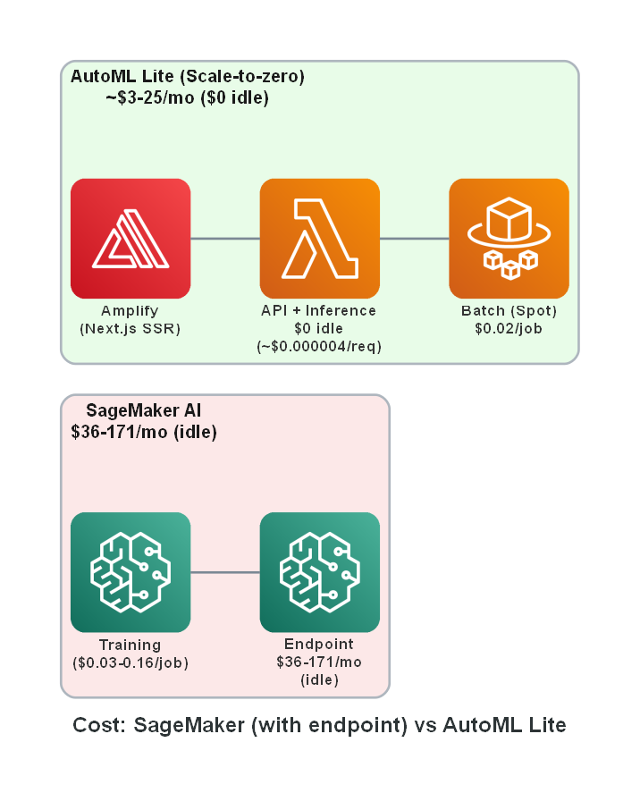
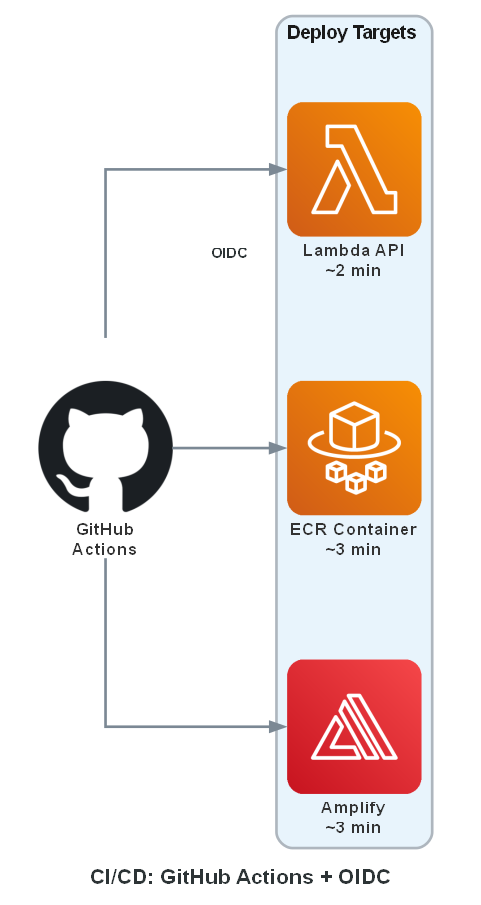

# Architecture Diagrams

Auto-generated AWS architecture diagrams for AWS AutoML Lite.

## Available Diagrams

| Diagram | Description | Used In |
|---------|-------------|---------|
| `architecture-main.png` | Main architecture overview | README, docs |
| `architecture-dataflow.png` | Data flow: Upload → Train → Download | PROJECT_REFERENCE |
| `architecture-cost.png` | Cost comparison with SageMaker | Documentation |
| `architecture-cicd.png` | CI/CD pipeline with GitHub Actions | SETUP_CICD.md |
| `architecture-training.png` | Training container internal flow | PROJECT_REFERENCE |

## Regenerating Diagrams

To regenerate or modify diagrams:

```bash
# Requirements
pip install diagrams
# Also install Graphviz: https://graphviz.org/download/

# Generate all diagrams
python scripts/generate_architecture_diagram.py
```

## Diagram Previews

### Main Architecture


### Data Flow


### Cost Comparison


### CI/CD Pipeline


### Training Container


## Customization

Edit `scripts/generate_architecture_diagram.py` to:
- Change colors (`bgcolor`, `fontcolor`)
- Adjust layout (`direction`: LR, TB, RL, BT)
- Modify spacing (`nodesep`, `ranksep`)
- Add new diagrams

## Tools Used

- **[diagrams](https://diagrams.mingrammer.com/)** - Python library for cloud architecture diagrams
- **[Graphviz](https://graphviz.org/)** - Graph visualization software (required dependency)
